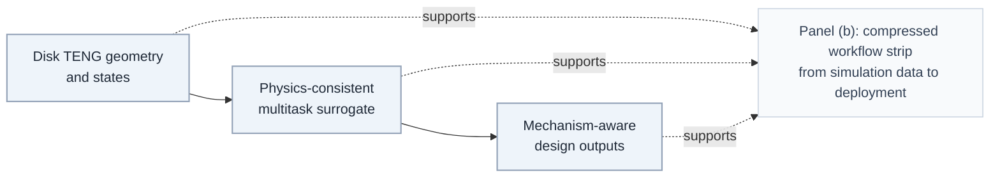

# Figure 1 Framework and Design Rationale

_Context: historical explanation note for the current Fig.1 workflow assets now stored under `figures_publication/src/fig01_workflow_support/`._

---

## 🧭 Overview

Figure 1 is designed as a **physics-guided narrative figure** rather than a simple model architecture diagram. Its job is to answer three questions in order:

1. **What is the physical system and what inputs matter?**
2. **How does the surrogate model encode those inputs and enforce physics consistency?**
3. **What actionable design outcomes come out of that modeling pipeline?**

The figure is therefore organized as a left-to-right story in panel `(a)`, followed by a compressed workflow strip in panel `(b)`.

## 🧱 Panel (a)

### Left Module

The left module, titled **Disk TENG geometry & states**, provides the physical starting point. It is intentionally not a full experimental setup schematic. Instead, it isolates the minimum physical information the reader needs before seeing the model:

- The two extreme operating states:
  - `Maximum overlap`
  - `Maximum misalignment`
- The geometry and dielectric parameters:
  - `n`
  - `h/R`
  - `d/R`
  - `ε`
- The state-dependent electrostatic cue:
  - `e⁻ flow`
  - `low ΔV`
  - `high ΔV`
- A compact legend for layer identity:
  - `Top electrode`
  - `Bottom electrode`
  - `Dielectric layer`
  - `Air gap`

The **Representative FEM map** at the bottom anchors the schematic to physics-based simulation evidence. It signals that the downstream surrogate is not abstract ML for its own sake; it is a reduced model built on field-based and electrostatic behavior.

### Center Module

The center module is the conceptual core of the figure. Its title is **Physics-consistent multitask surrogate** because the emphasis is not on a generic transformer block, but on the following pipeline:

1. A compact **4D input** description is formed from `n`, `h/R`, `d/R`, and `ε`.
2. These four inputs enter a **shared encoder**.
3. The shared encoder produces a common latent representation that feeds multiple task heads.
4. The task heads predict:
   - `Qsc`
   - `invC`
   - `FOMS_direct`
5. A **physical reconstruction** path computes `FOMS_phys ∝ Qsc² × invC`.
6. A **consistency constraint** encourages `FOMS_direct ≈ FOMS_phys`.

The internal visual language is chosen to make this logic readable at a glance:

- Input tokens: light gray-blue
- Attention-fusion nodes: medium gray-blue with a slight blue-violet tint
- Shared latent nodes: darker neutral gray-blue
- Task heads:
  - `Qsc`: orange
  - `invC`: blue
  - `FOMS_direct`: muted purple-gray (`#7A5C99`)

This module is not trying to teach the reader transformer internals. The transformer identity is deliberately reduced to a **small subtitle** and a **shared-encoder container**, while the dominant information is the mapping from structured inputs to coupled physical outputs.

### Right Module

The right module, titled **Mechanism-aware design outputs**, translates model predictions into design-facing results. It currently presents three outcome types:

- `Mechanism landscape`
- `Design window`
- `Safe region`

This is the payoff of the whole figure. The left module tells the reader what the system is, the center module tells the reader how the model reasons, and the right module tells the reader what the model is useful for.

## 🔁 Panel (b)

Panel `(b)` is a compressed workflow strip. It acts like a one-line executive summary of the full project pipeline:

- COMSOL data
- surrogate modeling
- physics consistency
- mechanism interpretation
- design-space identification
- unseen validation
- tool or deployment endpoint

Its role is not to replace panel `(a)`, but to summarize the full lifecycle once the reader already understands the main conceptual architecture.

## 🎯 Design Rationale

The figure follows four design principles.

### 1. Physics First

The left module makes it clear that the modeling task originates from geometry, dielectric properties, and electrostatic states of a disk TENG, not from arbitrary tabular inputs.

### 2. Shared Representation Over Model Detail

The center module avoids spending visual budget on transformer internals. The important message is:

- four structural inputs are jointly encoded,
- the latent representation is shared,
- multiple outputs are predicted together,
- and those outputs are linked by a physical consistency relation.

### 3. Design Utility as the Final Deliverable

The right module is outcome-oriented. It translates surrogate predictions into interpretable and actionable design knowledge rather than stopping at parity plots or raw regression outputs.

### 4. Consistency as a Scientific Constraint

The physical reconstruction branch is what prevents the center module from looking like a standard multitask ML diagram. It visually encodes the main scientific claim: direct prediction is not enough; it must remain consistent with reconstructed physics.

## 🧩 How to Read Figure 1

The intended reading order is:

1. Start at the left and identify the system, states, and four structural inputs.
2. Move to the center and understand how those four inputs are jointly encoded into a shared latent representation.
3. Observe the three task outputs and the reconstruction branch.
4. Read the bottom consistency relation as the scientific constraint tying the outputs together.
5. Finish on the right by interpreting the outputs as mechanism-aware design guidance.

## 📁 Related Files

| File | Role |
| --- | --- |
| `figures_publication/src/fig01_workflow_support/generate_fig01_editable_drawio.py` | Canonical script used to regenerate the editable draw.io/XML workflow figure |
| `figures_publication/src/fig01_method_workflow.drawio` | Mainline editable diagram artifact |
| `figures_publication/src/fig01_method_workflow.xml` | XML representation of the same figure |

## ✅ One-Sentence Summary

Figure 1 is structured to show how **disk-TENG geometry and operating states** are converted into **shared latent features**, then into **multiple physically linked outputs**, and finally into **mechanism-aware design guidance**.
